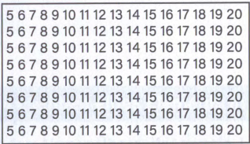

# 1 Grundlagen

### 1.1 Variablen

#### Übung 1.1.1
Schreiben Sie eine Reihe von Anweisungen, um 3 Variablen a, b und c zu deklarieren und ihnen die Werte **1**, **'France'** bzw. **36.2** zuzuweisen. Die Werte dieser Variablen sollen dann auf der Konsole angezeigt werden.

#### Übung 1.1.2
Schreiben Sie eine Reihe von Anweisungen, um eine Variable namens **message** zu deklarieren und mit dem Wert „hello“ zu initialisieren. Ändern Sie dann diese Variable so, dass sie den Wert „how are you“ enthält. Das Programm sollte den Inhalt der Variable nach der Änderung auf der Konsole ausgeben.

#### Übung 1.1.3
Schreiben Sie eine Reihe von Anweisungen, um 2 Variablen **x** und **y** zu deklarieren und ihnen die Werte 3 und 8.5 zuzuweisen. Konvertieren Sie dann den Typ dieser Variablen in Strings.
Das Programm soll nach der Umwandlung den Typ dieser Variablen am Ende anzeigen.

#### Übung 1.1.4
Schreiben Sie ein Programm, das den Benutzer nach seinem Gewicht in Kilogramm fragt und dieses in einer Variablen speichert. Das Programm soll am Ende das vom Benutzer eingegebene Gewicht anzeigen.

#### Übung 1.1.5
Schreiben Sie ein Programm, das zwei Zahlen vom Benutzer annimmt, die Zahlen addiert und das Ergebnis auf der Konsole ausgibt.

#### Übung 1.1.6
Schreiben Sie ein Programm, das zwei Zahlen vom Benutzer annimmt, die Zahlen dividiert und das Ergebnis auf der Konsole anzeigt. Was passiert, wenn der Divisor 0 ist?
a) Benutze Integer Division
b) Benutze Gleitkommazahlen Division

#### Übung 1.1.7
Schreiben Sie ein Programm, das zwei Gleitkommazahlen x = 22.0 und y = 7.0 dividiert und das Ergebnis auf der Konsole anzeigt. Verwenden Sie den Modulo-Operator, um das Ergebnis auf drei Dezimalstellen genau zu formatieren.

### 1.2 Bedingte Anweisungen

#### Übung 1.2.1
Erstellen Sie ein Programm mit dem Sie überprüfen können, ob eine eingegebene Integer größer ist als 5. Wenn ja, dann erfolgt eine Ausgabe auf dem Bildschirm.

#### Übung 1.2.2
Schreibe ein Programm das eine Zahl vom Nutzer entgegennimmt und auf der Konsole ausgibt ob die Zahl gerade oder ungerade ist.

#### Übung 1.2.3
Bei einem Wettbewerb müssen alle Teilnehmer in der Schwergewichtsklasse zwischen 235 und 265 Pfund wiegen. Schreiben Sie ein Programm, das nach dem Gewicht des Teilnehmers fragt und dann ausgibt, ob er zum Wettbewerb zugelassen ist.

#### Übung 1.2.4
Sie geben per Tastur 7 Zahlen ein. Das Programm gibt am Ende die größte Zahl aus.

#### Übung 1.2.5
Schreiben Sie ein Programm das überprüft, ob das Alter des Benutzers über 18 liegt oder nicht. Wenn das Alter des Benutzers größer oder gleich 18 ist, soll das Programm 'Der Benutzer ist volljährig' anzeigen, andernfalls 'Der Benutzer ist minderjährig'.

#### Übung 1.2.6
Eine Bank verfährt nach folgender Regel:
Wenn ein Kunde auf seinem Girokonto ein Guthaben von mehr als 1.000 Euro oder auf seinem Sparkonto ein Guthaben von mehr als 1.500 Euro hat, wird keine Scheckgebühr erhoben. Andernfalls wird eine Gebühr von 0,15 Euro erhoben. Schreiben Sie ein Programm, das nach dem Kontostand der beiden Konten fragt und dann ausgibt, wie hoch die Gebühr ist.

#### Übung 1.2.7
Ein Paketdienst berechnet 3,00 Euro Versandkosten bis zu einem
Gewicht von 10 Kilo (inklusive). Darüber sind für jedes Kilo zusätzlich 0,25 Euro zu bezahlen. Schreiben Sie ein Programm, das den Anwender nach dem Gewicht der Sendung fragt und dann die Versandkosten ausgibt.

Gewicht der Sendung: 11  
Versandkosten: 3,25 Euro  

#### Übung 1.2.8
Schreiben Sie ein Programm, mit dem Sie Werte von Euro nach DM und umgekehrt ausrechnen können. Der Anwender soll dabei nach dem Betrag gefragt werden und in welche Währung der Betrag umgerechnet werden soll. Dabei soll das Zeichen 'e' für die Berechnung DM -> Euro ausgewertet werden. Ist das eingegebene Zeichen ein anderes, soll die Berechnung Euro -> DM erfolgen.

Die Formel die Sie dazu benötigen sind:  
Euro = DM/1,95583 bzw.  DM = Euro * 1,95583  

#### Übung 1.2.9
Verändern Sie das Programm aus Übung 1.2.7 so, dass ab einem Gewicht von 20 Kilo 0.50 Euro für jedes Kilo über 10 Kilo zu bezahlen sind.

Gewicht der Sendung: 25  
Versandkosten: 10,50 Euro  

#### Übung 1.2.10
Schreiben Sie ein Programm, das den Anwender nach seinem Geburtsjahr fragt, kodiert mit zwei Ziffern, und nach dem aktuellen Jahr fragt, ebenfalls kodiert mit zwei Ziffern. Das Programm soll das richtige Alter des Anwenders in Jahren ausgeben.

Geburtsjahr: 62  
Aktuelles Jahr: 09  
Ihr Alter ist: 47  

#### Übung 1.2.11
Schreiben Sie ein Programm zur Berechnung von Schaltjahren.
Ob ein Jahr ein Schaltjahr ist, hängt von mehreren Bedingungen ab:
Ist ein Jahr durch 400 ohne Rest teilbar, ist es immer ein Schaltjahr. Ist ein Jahr durch 4, jedoch nicht durch 100 teilbar, ist es ein Schaltjahr. In allen anderen Fällen ist es kein Schaltjahr. Schreiben Sie ein Programm „Schaltjahr", das nach einer Jahreszahl fragt und danach überprüft, ob es sich bei dem Jahr um ein Schaltjahr handelt. Nach der Prüfung soll ausgegeben werden, ob es ein Schaltjahr ist oder nicht.

#### Übung 1.2.12
Der Hersteller eines Mikrowellenherds empfiehlt beim Erhitzen von zwei Portionen 50% mehr Erhitzungszeit und beim Erhitzen von drei Portionen, die Erhitzungszeit zu verdoppeln. Das Erhitzen von mehr als drei Portionen wird nicht empfohlen. Schreiben Sie ein Programm, das den Anwender nach der Anzahl der Portionen und nach der Erhitzungszeit für eine Portion fragt. Das Programm gibt dann die empfohlene Erhitzungszeit aus. Hinweis: Verwenden Sie vier aufeinander folgende if-Abfragen ohne else-Zweig, wobei jede von ihnen einen von vier Fällen testet: eine Portion, zwei Portionen, drei Portionen, mehr als drei Portionen.

#### Übung 1.2.13
Sepps Tanke befindet sich an der A565 in Bonn am Rande der Eifel. Die nächsten 200 Kilometer gibt es keine weitere Tankstelle. Schreiben Sie ein Programm, das den Fahrern hilft zu entscheiden, ob sie tanken sollen oder nicht.

Das Programm fragt nach:
-	Der Tankkapazität in Litern  
-	Der Benzinanzeige in Prozent (voll = 100, dreiviertel voll = 75, usw.)  
-	Dem Benzinverbrauch des Fahrzeugs in km pro Liter.  

Die Ausgabe des Programms ist „Tanken!" oder „Weiterfahren", je nachdem, ob das Fahrzeug genug Benzin für 200 Kilometer hat oder nicht.

    Beispiel:  
    Tankkapazität: 12  
    Benzinanzeige in %: 50  
    Benzinverbrauch km/l: 30  
    Tanken!  

### 1.3 Schleifen

#### Übung 1.3.1
Schreiben Sie ein Programm, das über eine for-Schleife von 0 bis 20 läuft. Geben Sie bei jedem Schritt den Wert des Schleifenzählers aus.

#### Übung 1.3.2
Schreiben Sie ein Programm, das über eine for-Schleife von 0 bis 20 in Zweier-Schritten läuft. Geben Sie bei jedem Schritt den Wert des Schleifenzählers aus.

#### Übung 1.3.3
Schreiben Sie ein Programm, das über eine for-Schleife von 40 bis 0 läuft. Geben Sie bei jedem Schritt den Wert des Schleifenzählers aus.

#### Übung 1.3.4
Schreiben Sie ein Programm, das die folgende Summe berechnet:
**Summe = 1 + 2 + 3 + 4 + ... + n**. Die Variable n ist vom Typ integer und soll vom Anwender eingegeben werden. Das Ergebnis soll am Ende der Berechnung ausgegeben werden.

#### Übung 1.3.5
Schreiben Sie ein Programm, welches das Produkt der ungeraden Zahlen berechnet **Produkt = 1 * 3 * 5 * ... * n**. Die Variable n ist vom Typ integer und soll vom Anwender eingegeben werden. Das Ergebnis soll am Ende der Berechnung ausgegeben werden.

#### Übung 1.3.6
Entwickeln Sie ein Programm, das mit Hilfe einer Zählschleife jeden durch **7** teilbaren Wert zwischen 1 und 100 anzeigt.

#### Übung 1.3.7
Schreiben Sie ein Programm, das Integer addiert, die vom Benutzer eingegeben werden. Das Programm fragt vorher, wie viele Zahlen addiert werden sollen. Danach fordert das Programm den Benutzer auf, die Zahlen nacheinander einzugeben. Schließlich gibt es das Ergebnis auf dem Bildschirm aus. Realisieren Sie das Programm mit einer for-Schleife.

#### Übung 1.3.8
Entwickeln Sie ein Programm mit Schleifen, das ein 7x7-Rechteck, wie folgt ausgibt:

XXXXXXX  
XXXXXXX  
XXXXXXX  
XXXXXXX  
XXXXXXX  
XXXXXXX  
XXXXXXX  

#### Übung 1.3.9
Entwickeln Sie ein Programm mit Schleifen, das ein 7x7-Rechteck, wie folgt ausgibt:

X------  
-X-----  
--X----  
---X---  
----X--  
-----X-  
------X  

#### Übung 1.3.10
Entwickeln Sie ein Programm mit Schleifen, das ein 7x7-Rechteck, wie folgt ausgibt:

X-----x  
-X---X-  
--X-X--  
---X---  
--X-X--  
-X---X-  
X-----X  

#### Übung 1.3.11
Entwickeln Sie ein Programm mit Schleifen, das ein 7x7-Rechteck, wie folgt ausgibt:

X------  
-X-----  
--X----  
---XXXX  
--X----  
-X-----  
X------  

#### Übung 1.3.12
Entwickeln Sie ein Programm für einen einarmigen Banditen. Der Spieler erhält 10 Coins. Jedes Spiel kostet 1 Coin. Wenn zwei gleiche Werte kommen, gewinnt der Spieler 3 Coins, bei 3 gleichen Werten erhält er sofort l0 Coins.

Mögliche Anzeige:

3	6	1	leider verloren, Guthaben 9 Coins  
3	3	5	3 Coins, Guthaben 11 Coins  
5	3	5	3 Coins, Guthaben 13 Coins  

Unser Automat verfügt über 10 Figuren (0 bis 9), die mit dem Zufallszahlgenerator erzeugt werden.

#### Übung 1.3.13
Entwickeln Sie ein Programm mit Schleifen, das ein Sägezahnblatt wie folgt ausgibt:
```
*  
***  
*****  
*******  
*********  
***********  
*************  
```
#### Übung 1.3.14
Entwickeln Sie ein Programm mit Schleifen, das ein Sägezahnblatt
wie folgt ausgibt:
```
********  
*******   
******   
*****  
****  
***  
**  
*  
```
#### Übung 1.3.15
Entwickeln Sie ein Programm mit Schleifen, das einen Tannenbaum wie folgt ausgibt:
```
	     *  
	    ***  
	   *****  
	  *******  
	 *********  
	***********  
	    ***  
	    ***  
	    ***  
```
#### Übung 1.3.16
Entwickeln Sie die nachfolgenden for-Schleifen jeweils als while-Schleife:

```python
for i in range(7):
    print(i)

for i in [2,5,3,1,4]:
    print(i)
```

#### Übung 1.3.17
Schreiben Sie ein Programm, mit dem Sie die Quersumme einer Zahl unter Zuhilfenahme einer while-Schleife berechnen können. Hinweis: Zur Berechnung der Quersumme benötigen Sie den Modulo-Operator und die ganzzahlige Division.

#### Übung 1.3.18
Ein Kunde schuldet seiner Kreditkartengesellschaft 1.000,00 Euro. Die Gesellschaft berechnet ihm monatlich 1,5% Zinsen für den gewährten Kredit. Er entscheidet sich, die Kreditkarte nicht mehr zu verwenden und seinen Kredit monatlich mit einem bestimmten Betrag **n** zurückzuzahlen. Schreiben Sie ein Programm, das nach dem monatlichen Rückzahlungsbetrag fragt und dann den Saldo und den Gesamtbetrag der Zahlungen für jeden Monat ausgibt, bis der Saldo 0 oder weniger beträgt.

**Beispielausgabe:**

Geben Sie den monatlichen Betrag ein: 100  
Monat: 1 Saldo: 915,0 Gesamtbetrag: 100,0  
Monat: 2 Saldo: 828,725 Gesamtbetrag: 200,0  
Monat: 3 Saldo: 741,155875 Gesamtbetrag: 300,0  
Monat: 4 Saldo: 652,273213125 Gesamtbetrag: 400,0  
Monat: 5 Saldo: 562,057311321875 Gesamtbetrag: 500,0  
Monat: 6 Saldo: 470,4881709917031 Gesamtbetrag: 600,0  
Monat: 7 Saldo: 377,54549355657866 Gesamtbetrag: 700,0  
Monat: 8 Saldo: 283,20867595992735 Gesamtbetrag: 800,0   
Monat: 9 Saldo: 187,4568060993263 Gesamtbetrag: 900,0   
Monat: 10 Saldo: 90,26865819081618 Gesamtbetrag: 1000,0   
Monat: 11 Saldo: -8,377311936321576 Gesamtbetrag: 1100,0  

Berechnen Sie die monatlichen Zinsen auf Grund des Saldos.  
Berechnen Sie dann den neuen Saldo, indem Sie die Zinsen addieren  
und den zurückgezahlten Betrag subtrahieren.  

#### Übung 1.3.19
Schreiben Sie ein Programm, das die folgenden Zahlen auf der Konsole ausgibt: 



#### Übung 1.3.20
Schreiben Sie ein Programm, das ein Ratespiel implementiert:
Das Programm wählt eine Zufallszahl zwischen 1 und 10 aus. Jetzt hat der Spieler drei Versuche. Sobald der Spieler die richtige Zahl eingibt, gibt das Programm eine Meldung über den Gewinn des Spiels aus und endet. Wenn der Spieler nach drei Versuchen die Zahl nicht erraten hat, gibt das Programm eine Meldung über den Misserfolg aus und endet. Sie benötigen dazu die import-Anweisung mit random, und die Funktion random.randint(1, 10) die eine Zufallszahl zwischen 1 und <= 10 erzeugt:

Hier sind zwei Probeläufe des Programms:  

Ich denke an eine Zahl zwischen 1 und 10.  
Sie haben drei Versuche, um die Zahl zu erraten.  
Geben Sie eine Zahl ein: 4 falsch  
Geben Sie eine Zahl ein: 8 RICHTIG!  
Sie haben das Spiel gewonnen.  

Ich denke an eine Zahl zwischen 1 und 10.  
Sie haben drei Versuche, um die Zahl zu erraten.  
Geben Sie eine Zahl ein: 1 falsch  
Geben Sie eine Zahl ein: 5 falsch  
Geben Sie eine Zahl ein: 9 falsch  
Die richtige Zahl war 7.  
Sie haben das Spiel verloren.  

[Python random.randint](https://www.w3schools.com/python/ref_random_randint.asp)  
[C# Random](https://learn.microsoft.com/de-de/dotnet/api/system.random.next?view=net-8.0)  

#### Übung 1.3.21
Entwickeln Sie ein Programm mit Schleifen, das ein 7x7-Rechteck, wie folgt ausgibt:

X--X---  
-X-X---  
--XX---  
---X---  
---XX--  
---X-X-  
---X--X  

#### Übung 1.3.22
Entwickeln Sie ein Programm mit Schleifen, das die folgende Struktur auf dem Bildschirm ausgibt:

```
........   
........  
........   
........   
========  
========  
========  
========  
```

#### Übung 1.3.23
Entwickeln Sie ein Programm mit Schleifen, das die folgende Struktur auf dem Bildschirm ausgibt:

```
....====   
....====  
....====  
....====  
========  
========  
========  
========  
```

#### Übung 1.3.24
Entwickeln Sie ein Programm mit Schleifen, das die folgende Struktur auf dem Bildschirm ausgibt:

```
....====   
....====  
....====  
....====  
====....  
====....  
====....  
====....  
```

#### Übung 1.3.25
Entwickeln Sie ein Programm mit Schleifen, das ein 7x7-Rechteck, wie folgt ausgibt:

```
X--X--x  
-X-X-X-  
--XXX--  
XXXXXXX    
--XXX--  
-X-X-X-  
X--X--X  
```

#### Übung 1.3.26
Entwickeln Sie ein Programm mit Schleifen, das die folgende Struktur auf dem Bildschirm ausgibt:

```
X------X  
-X----X-  
--X--X--  
---XX---  
--XXXX--  
-XXXXXX-   
XXXXXXXX   
```

#### Übung 1.3.27
Entwickeln Sie ein Programm mit Schleifen, das die folgende Struktur auf dem Bildschirm ausgibt:

```
*     *
**   **
*** ***
*******
*** ***
**   **
*     *
```

#### Übung 1.3.28
Entwickeln Sie ein Programm mit Schleifen, das die folgende Struktur auf dem Bildschirm ausgibt:

```
ooooooooooo
oi...X...io
o.i..X..i.o
o..i.X.i..o
o...iXi...o
oXXXXXXXXXo
o...iXi...o
o..i.X.i..o
o.i..X..i.o
0i...X...io
ooooooooooo
```

#### Übung 1.3.29
Entwickeln Sie ein Programm mit Schleifen, das die folgende Struktur auf dem Bildschirm ausgibt:

```
*     *
**   **
* * * *
*  *  *
* * * *
**   **
*     *
```

#### Übung 1.3.30
Entwickeln Sie ein Programm mit Schleifen, das die folgende Struktur auf dem Bildschirm ausgibt:

```
     o     
    o o
   o   o
  o     o
 o       o
o         o
 o       o
  o     o
   o   o
    o o
     o
```

#### Übung 1.3.31
Erstellen Sie ein Programm, dass mithilfe einer for-Schleife und der if-Abrage folgede Ausgabe realisiert:
```51 152 53 54 155 56 57 158 59 60 161 62 63 164 65 66 167 68 69```

#### Übung 1.3.32
Erstellen Sie ein Programm, dass mithilfe einer for-Schleife und der if-Abrage folgede Ausgabe realisiert:
```1 502 503 4 5 6 507 508 9 10 11 512 513 14 15 16 517 518 19 20```

#### Übung 1.3.33
Erstellen Sie ein Programm, dass mithilfe einer for-Schleife und der if-Abrage folgede Ausgabe realisiert:
```21 22 23 24 20 26 27 28 29 25 31 32 33 34 30 36 37 38 39 35 41```

#### Übung 1.3.34
Erstellen Sie ein Programm, dass das kleine Einmaleins auf dem Bildschirm ausgibt:

  

#### Übung 1.3.35
Schreiben Sie ein Programm, das die Zahlen aus dem Bereich 1 bis 999 ausgibt.
Zusatzbedingungen:
a) In keiner dieser Zahlen darf die Ziffer 7 vorkommen.  
b) In jeder Zeile sollen 10 Zahlen rechtsbündig erscheinen.  
c) Die Zahlen sollen Spalten bilden.  

  

#### Übung 1.3.36
Schreiben Sie ein Programm, das folgende Struktur auf dem Bildschirm ausgibt:

```
X X X X  
 X X X   
X X X X  
 X X X   
X X X X  
 X X X   
X X X X
```

### 1.4 Functions
[Funktionen - Python](https://www.geeksforgeeks.org/python-functions/)  
[Funktionen - C#](https://www.w3schools.com/cs/cs_methods.php)  

**!! In C# Functions exist only as Methods inside of Classes !!**

#### Übung 1.4.1
Schreiben Sie eine Funktion mit dem Namen mathTest(a ,b ,x), die 3 Ganzzahlen a, b und x als Parameter entgegennimmt und das Ergebnis der folgenden Funktion zurückgibt:
```f(a, b, x) = a*(X**3) + 2*a*(x**2) + b```

Überprüfung: 
```python
>>> mathTest(3, 0, 1)
9
>>> mathTest(0, 2, 2)
2
```

#### Übung 1.4.2
Schreiben Sie eine Funktion die 2 Parameter entgegenimmt. Der erste Paramter ist eine Liste mit Elementen. Der zweite Parameter ist eine Element. Es soll überprüft werden ob das Element in der Liste vorhanden ist.

Überprüfung: 
```python
>>> elementInList([1,2,3,4,5,6], 2)
True
>>> elementInList([3,6,9,7,11], -1)
False
```

#### Übung 1.4.3
Schreiben Sie eine Funktion mit welcher die Summe aller Elemente in einer Liste brechnet wird.

Überprüfung: 
```python
>>> sumOfElements([1,2,3,4,5,6])
21
>>> sumOfElements([3,6,9,7,11])
36
```

#### Übung 1.4.4
Schreiben Sie eine Funktion removeDuplicates(lst), die eine Listen von Ganzzahlen als Parameter entgegennimmt und die Liste ohne Duplikate in aufsteigender Reihenfolge zurückgibt.

Überprüfung:
```python
>>> removeDuplicates([0,3,5,7,3,5,1,-1])
[-1,0,1,3,5,7]
>>> removeDuplicates([0,5,9,10,3,2,1,-3])
[-3,0,1,2,3,5,9,10]
```
#### Übung 1.4.5
Schreiben Sie eine Funktion maximum(lst), die eine Liste von Ganzzahlen als Parameter entgegennimmt und den größten Wert zurückgibt.
Hinweis: Es darf keine bestehnde Funktion max() genutzt werden für die Lösung der Aufgabe.

Überprüfung
```python
>>> maximum([-9,2,4,1,8])
8
>>> maximum([-3,1,7,6,2,3])
7
```

#### Übung 1.4.6
Schreiben Sie eine Funktion minimum(lst), die eine Liste von Ganzzahlen als Parameter erhält und den kleinsten Wert zurückgibt.

```python
Überprüfung:
>>> minimum([-9,2,4,1,8])
-9
>>> minimum([-3,1,7,6,-4,3])
-4
```

#### Übung 1.4.7
Schreiben sie eine Funktion sliceSum(lst, start, end), die drei Parameter annimmt: eine Liste **lst**, einen Startindex **start** und einen Endindex **end**. Die Funktion soll die Summe der Zahlen zwischen den Indizes start und end zurückgeben.
(Endindex inklusive)

```python
Überprüfung:
>>> sliceSum([4,10,12,16,18],2,4)
46
>>> sliceSum([2,4,6,8,10,12],0,1)
6
```

#### Übung 1.4.8
Schreiben Sie eine Funktion length(lst), die eine Liste als Parameter erhält und die Anzahl der Elemente in dieser Liste zurückgibt.

```python
Überprüfung:
>>> length([2,7,23,44,1,0])
6
>>> length([])
0
```

### 1.5 Sonstiges

#### Übung 1.5.1
Schhreiben sie ein programm, das eine Dezimalzahl auf 2 Stellen nach dem Komma abschneidet. Beispiel wenn wir die Dezimalzahl 187.632587 verwenden, sollte das Programm 187.63 anzeigen.
Hinweis: Sie können den Modulo Operator benutzen oder fortgeschrittene Formatierungsmöglichkeiten.

[Formatierung mit Python](https://docs.python.org/3/tutorial/inputoutput.html)  
[Formatierung mit C#](https://learn.microsoft.com/en-us/dotnet/csharp/language-reference/tokens/interpolated)  

#### Übung 1.5.2
Schreiben Sie ein Programm, das den Zeichenketten-Text "Ich heiße meinName und bin alter Jahre alt. Ich lerne die Programmiersprache sprache' formatiert.
Das Programm soll dieser Zeichenkette den Inhalt der folgenden Variablen zuweisen: meinName = "Julien", alter = 32, sprache = "Python"
Das Programm wird auf der Konsole folgenden Text anzeigen: "Ich heiße Julien und bin 32 Jahre alt. Ich lerne die Programmiersprache Python."

#### Übung 1.5.3
Schreiben Sie ein Programm das die 'Dateierweiterung' einer Datei ermittelt. Der Name der Datei ist als String datei = 'image.png' gegeben. Die Konsole soll '.png' ausgeben.

#### Übung 1.5.4
Schreiben Sie ein Programm, das die Ausführungszeit eines Skripts berechnet. Nehmen Sie eines der Programme die Sie zuvor entwickelt haben. Das Programm soll am Ende die die Ausführungszeit anzeigen.

#### Übung 1.5.5
Schreiben sie ein Programm, dass Lottozahlen ermittelt die auf der Konsole ausgegeben werden. Die Zahlen sollen zufällig ermittelt werden und müssen natürlich unterschiedlich sein. 

#### Übung 1.5.6
Schreiben Sie ein Programm, das feststellt ob eine eingegebene Zahl eine Primzahl ist. Die erste Primzahl ist 2.

#### Übung 1.5.7
Schreiben Sie ein Stein, Schere, Papier Spiel das der Benutzer gegen den Computer spielen kann. Berücksichtigen sie falsche Eingaben seitens des Spielers. Für dieses Programm können sie die Funktion choice() aus dem modul random verwenden.

```from random import choice```

Mögliche Ausgabe:  
Stein, Papier oder Schere?: Schere  
Computer: Stein  
Spieler: Schere  
Du hast verloren!  
Nochmal spielen?(ja/nein): nein  
Tschüss  

# 2 Datenstrukturen

### 2.1 Arrays

### 2.2 Listen

#### Übung 2.2.1
Schreiben sie die Anweisung, um eine Liste von Zahlen von 1 bis 10 zu erstellen. Geben sie die Liste anschließend auf der Konsole aus.

#### Übung 2.2.2
Schreiben sie die Anweisung, um eine Liste von geraden Zahlen von 1 bis 10 zu erstellen. Geben sie die Liste anschließend auf der Konsole aus.

#### Übung 2.2.3
Schreiben Sie die Anweisungen, um eine Liste mit dem Wert `[6,8,3,4,1,12,2,9.2]` zu erstellen und ordnen Sie die Zahlen in aufsteigen- der Reihenfolge an. Das Programm soll die Liste nach der Sortierung der Zahlen anzeigen.

#### Übung 2.2.4
Schreiben Sie die Anweisungen, um eine Liste mit folgenden Werten zu erstellen `[3,2,2,1,9,1,2,3,7]` und zählen Sie die Anzahl der Vorkommen der Zahl 1 in der Liste.

#### Übung 2.2.5
Schreiben Sie die Anweisungen, um eine leere Liste zu erstellen und dann die Ganzzahlen **10, 25, 30, 45, 90** sowie die Zeichenketten **'ab'**, **'cd'** und **'ef'** zur Liste hinzuzufügen.

#### Übung 2.2.6
Schreiben Sie ein Programm, das eine Liste mit dem Wert `[1,2,3,4,5,6,7,8,9,10]` erstellt und dann eine neue Liste erstellt, die jedes dritte Element aus der ersten Liste enthält. In diesem Fall sollten wir am Ende die folgende Liste erhalten: `[1,4,7,10]`.

#### Übung 2.2.7
Schreiben Sie die Anweisungen, um eine Zeichenkette in aufsteigender alphabetischer Reihenfolge zu sortieren. Zum Testen nehmen wir die Zeichenkette **c = 'Frankreich'** Das Programm sollte **'aceFhiknrr'** zurückgeben. Hinweis: wenn sie sort() oder sorted() verwenden nutzt der Sortieralgorithmus den ASCII-Wert der Character als Grundlage. Das bedeutet das Großbuchstaben vor kleingeschriebenen Buchstaben landen. Finden Sie einen Weg dies zu umgehen. Große Buchstaben sollen in der Ausgabe ebenfalls großgeschrieben sein.

#### Übung 2.2.8
Schreiben Sie ein Programm, das zwei Listen listeEins und listeZwei enthält und eine Liste listeDrei zurückgibt, die die gemeinsamen Elemente zwischen listeEins und listeZwei enthält.

liste_eins = [9, 8, 7, 14, 3, 2, "a", "p", "hallo", "b"]  
liste_zwei = ["b", 1, 9.2, 6, 3, 9, "p"]  

#### Übung 2.2.9
Schreiben Sie ein Programm, um eine Liste von Tupeln basierend auf dem zweiten Element des Tupels in aufsteigender Reihenfolge zu sortieren.

Die zu betrachtende Liste in dieser Übung ist:
fruechte = [("Apfel", 15), ("Banane", 8), ("Fräser", 12), ("Kiwi", 9), ("Pfirsich", 2)]
Die Liste 'fruechte', die wir am Ende des Programms haben sollten (nach der Sortierung):
fruechte = [("Pfirsich",2), ("Banane",8), ("Kiwi",9), ("Fräser",12), ("Apfel",15)]

[Was ist ein Tupel?](https://www.w3schools.com/python/python_tuples.asp)

#### Übung 2.2.10
Schreiben Sie ein Programm, um eine Zeichenkette umzukehren. Das Programm soll die Variable ch umkehren, die den Satz 'Hallo alle zusammen' enthält.

#### Übung 2.2.11
Schreiben Sie ein Programm, das eine Liste mit 20 Zufallszahlen aus einer Menge (1-100) zu erstellen.

Sie brauchen das Modul Random mit der [randint()](https://www.w3schools.com/python/ref_random_randint.asp) Funktion um diese Aufgabe zu lösen.

```python
from random import randint
```

#### Übung 2.2.12
Denken Sie an mindestens drei Sorten Ihrer Lieblingspizza. Speichern Sie diese Pizzanamen in einer Liste, und geben Sie dann in einer for-Schleife den Namen jeder Pizza auf der Konsole aus.

a) Ändern Sie Ihren Code so, dass ein ganzer Satz mit dem Namen der Pizza ausgegeben wird.

#### Übung 2.2.13
Eine Zahl, die in die dritte Potenz erhoben wird, wird als Kubikzahl bezeichnet. Zum Beispiel wird der Kubus von 2 in Python als 2**3 geschrieben. Erstellen Sie eine Liste der ersten 10 Würfel (d. h. der Würfel jeder ganzen Zahl von 1 bis 10), und verwenden Sie eine for-Schleife, um den Wert jedes Würfels auszugeben.

#### Übung 2.2.14
Fügen Sie mit einem der Programme, die Sie in diesem Kapitel geschrieben haben, am Ende des Programms mehrere Codezeilen ein, die Folgendes bewirken:
- Geben Sie die Meldung aus: Die ersten drei Elemente in der Liste sind: ...
- Drucke die Nachricht: Die drei Einträge in der Mitte der Liste sind: ..: ...
- Drucken Sie die Nachricht: Die letzten drei Einträge in der Liste sind: ..: ...

[Slicing](https://www.freecodecamp.org/news/slicing-and-indexing-in-python/)

#### Übung 2.2.15
Schreiben sie ein Programm, das ein Element aus einer Liste entfernt. Gegeben ist die Liste zahlen = [1,2,3,4,5] und wir möchten die Zahl 1 entfernen.

#### Übung 2.2.16
Schreiben Sie ein Programm, das die Elemente einer Liste zufällig mischt.
Elemente = [3,6,8,7,2,'s','ch','d']

#### Übung 2.2.17
Schreiben Sie ein Programm, das eine Integer Liste mit 10 Elementen mit Zahlen aus dem Bereich -40 bis 50 initialisiert.

Geben Sie diese Liste zeilenweise formatiert (:4d) aus. Danach drehen Sie die Liste um (die letzten werden die ersten) und anschließend geben Sie die Liste erneut aus.

Beispiel:
Erste Liste: 10  -20  3  -10  45  23  -11  0  1  -23  
Zweite Liste: -23  1  0  -11  23  45  -10  3  -20  10  

### 2.3 Wörterbücher

#### Übung 2.3.1
Schreiben Sie ein Programm, das den Wert der Schlüssel 'Apfel' und 'Banane' des Wörterbuchs {'Apfel': 3, 'Banane': 7, 'Kiwi': 1} auf der Konsole anzeigt.

#### Übung 2.3.2
Schreiben Sie ein Programm, das die Werte des fogenden Wörterbuchs summiert:
{'Apfel': 15, 'Banane': 8, 'Fräser': 12, 'Kiwi': 9, 'Pfirsich': 2}

#### Übung 2.3.3: 
Hinzufügen von Elementen zu einem Wörterbuch. Die Funktion addToDicitonary (elementKey, elementValue, d) nimmt 3 Parameter entgegen: ein Wörterbuch **d**, einen Schlüssel **elementKey** und den zugehörigen Wert **elementValue**. Die Funktion soll diesen Schlüssel und seinen Wert dem Wörterbuch d hinzufügen. Schließlich soll die Funktion das Wörterbuch d mit dem neuen Schlüssel zurückgeben.

Überprüfung:
```python
>> addToDictionary("baptiste", 29, {"julien": 14, "laurent":31})  
("julien": 14, "laurent" : 31, "baptiste": 29}  
>> addToDictionary("Gewicht", 65.3, {})  
("Gewicht": 65.3}  
```

### 2.4 Stack

### 2.5 Queues

### 2.6 Verknüpfte Listen


# Nr. 3 Algorithmen

### 3.1 Sortieren

### 3.2 Suchen

### 3.3 Rekursion

### 3.4 Dynamische Programmierung

### 3.5 Graphenalgorithmen


# 4 Fortgeschrittene Themen

### 4.1 Objektorientierte Programmierung (OOP)

### 4.2 Datei-I/O

### 4.3 Behandlung von Ausnahmen

### 4.4 Reguläre Ausdrücke

### 4.5 Datum und Uhrzeit

### 4.6 Unit-Tests

### 4.7 Web Scraping