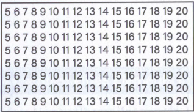
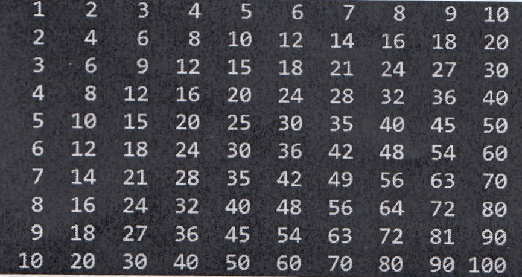
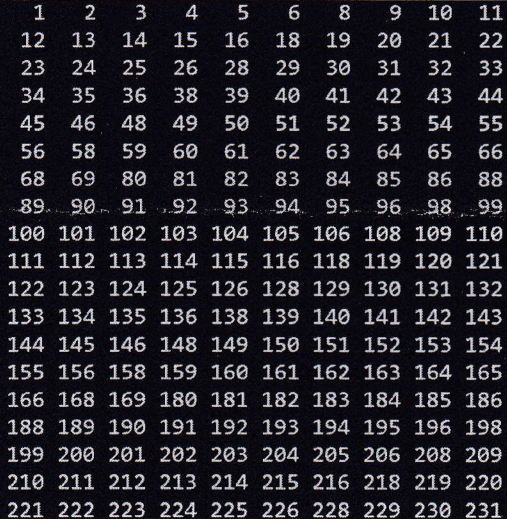

# 1 Basics

### 1.1 Variables

#### Exercise 1.1.1
Write a series of statements to declare 3 variables a, b and c and assign them the values **1**, **'France'** and **36.2** respectively. The values of these variables should then be displayed on the console.

#### Exercise 1.1.2
Write a series of statements to declare a variable called **message** and initialize it with the value “hello”. Then change this variable to contain the value “how are you”. The program should output the content of the variable to the console after the change.

#### Exercise 1.1.3
Write a series of statements to declare 2 variables **x** and **y** and assign them the values 3 and 8.5. Then convert the type of these variables to strings.
The program should display the type of these variables at the end after the conversion.

#### Exercise 1.1.4
Write a program that asks the user for his weight in kilograms and stores it in a variable. The program should display the weight entered by the user at the end.

#### Exercise 1.1.5
Write a program that accepts two numbers from the user, adds the numbers and displays the result on the console.

#### Exercise 1.1.6
Write a program that accepts two numbers from the user, divides the numbers and displays the result on the console. What happens if the divisor is 0?
a) Use integer division  
b) Use floating point division  

#### Exercise 1.1.7
Write a program that divides two float variables x = 22.0 and y = 7.0 and displays the result on the console. Use the modulo operator to format the result to three decimal places precision.

### 1.2 Conditionals

#### Exercise 1.2.1
Write a program with which you can check whether an entered integer is greater than 5. If so, an output is displayed on the console.

#### Exercise 1.2.2
Write a program that accepts a number from the user and outputs to the console if the number is even or odd.

#### Exercise 1.2.3
In a competition, all participants in the heavyweight class must weight between 235 and 265 pounds. Write a program that asks for the competitors weight and then outputs whether he is eligible to participate in the competition or not.

#### Exercise 1.2.4
You enter 7 numbers using the keyboard. At the end, the program displays the the largest number.

#### Exercise 1.2.5
Write a program that checks whether the user's age is over 18 or not. If the user's age is greater than or equal to 18, the program should display 'The user is of legal age', otherwise 'The user is a minor'.

#### Exercise 1.2.6
A bank proceeds according to the following rule:
If a customer has a balance of more than 1,000 euros in their current account or a balance of more than 1,500 euros in their savings account, no check fee is charged. Otherwise, a fee of 0.15 euros will be charged. Write a program that asks for the balance of the two accounts and then outputs how much the fee is.

#### Exercises 1.2.7
A parcel service charges 3.00 euros shipping costs up to a weight of
10 kilos (inclusive). Above this weight, an additional 0.25 euros must be paid for each kilo. Write a program that asks the user for the weight of the shipment and then displays the shipping costs.

Weight of the shipment: 11  
Shipping costs: 3.25 euros  

#### Exercise 1.2.8
Write a program to calculate values from Euro to DM and vice versa. The user should be asked for the amount and into which currency the amount should be converted. The character 'e' should be evaluated for the calculation DM -> Euro. If the character entered, is a different character, the calculation should be Euro -> DM.

The formula you need for this is Euro = DM/1.95583 or DM = Euro * 1.95583

#### Exercise 1.2.9
Change the program from exercise 1.2.7 in a way, that from a weight of 20 kilos, 0.50 euros must be paid for every kilo over 10 kilos.

Weight of the shipment: 25   
Shipping costs: 10.50 euros  

#### Exercise 1.2.10
Write a program that asks the user for his year of birth, coded with two digits, and asks for the current year, also coded with two digits. The program should output the correct age of the user in years.

Year of birth: 62  
Current year: 09  
Your age is: 47  

#### Exercise 1.2.11
Write a program to calculate leap years. Whether a year is a leap year depends on several conditions: If a year is divisible by 400 without a remainder, it is always a leap year. If a year is divisible by 4 but not by 100, it is a leap year. In all other cases, it is not a leap year. Write a program that asks for a year number and then checks whether the year is a leap year. After the check, the program should output if it's a leap year or not.

#### Exercise 1.2.12
The manufacturer of a microwave oven recommends 50% more heating time when heating two portions and double the heating time when heating three portions. Heating more than three portions is not recommended. Write a program that asks the user for the number of portions and the heating time for one portion. The program will then output the recommended heating time. Note: Use four consecutive if queries without an else branch, each of them testing one of four cases: one serving, two servings, three servings, more than three servings.

#### Exercise 1.2.13
Sepp's petrol station is located on the A565 in Bonn on the edge of the Eifel. There is no other filling station for the next 200 kilometers. Write a program that helps drivers to decide whether they should refuel or not.

The program asks:  
- The tank capacity in liters  
- The fuel gauge in percent (full = 100, three-quarters full = 75, etc.)  
- The fuel consumption of the vehicle in km per liter.  

The output of the program is “Refuel!” or “Continue driving”, depending on whether the vehicle has enough fuel for 200 kilometers or not.

    Example:  
    Tank capacity: 12  
    Fuel gauge in %: 50  
    Fuel consumption km/l: 30   
    Refuel!  

### 1.3 Loops

#### Exercise 1.3.1
Write a program that runs in a for loop from 0 to 20. Output the value of the loop counter at each step.

#### Exercise 1.3.2
Write a program that runs via a for loop from 0 to 20 in steps of two. Output the value of the loop counter at each step.

#### Exercise 1.3.3
Write a program that runs in a for loop from 40 to 0. Output the value of the loop counter at each step.

#### Exercise 1.3.4
Write a program that calculates the following sum:
**Sum = 1 + 2 + 3 + 4 + ... + n**. The variable n is of type integer and is to be entered by the user. The result should be output at the end of the calculation.

#### Exercise 1.3.5
Write a program that calculates the product of odd numbers **Product = 1 * 3 * 5 * ... * n**. The variable n is of type integer and is to be entered by the user. The result should be output at the end of the calculation.

#### Exercise 1.3.6
Develop a program that uses a counting loop to display every value between 1 and 100 that is divisible by **7**.

#### Exercise 1.3.7
Write a program that adds integers entered by the user. The program first asks how many numbers are to be added. Then the program asks the user to enter the numbers one after the other. Finally, it displays the result on the screen. Implement the program with a for loop.

#### Exercise 1.3.8
Develop a program with loops that outputs a 7x7 rectangle as follows:

XXXXXXX  
XXXXXXX  
XXXXXXX  
XXXXXXX  
XXXXXXX  
XXXXXXX  
XXXXXXX  

#### Exercise 1.3.9
Develop a program with loops that outputs a 7x7 rectangle as follows:

X------  
-X-----  
--X----  
---X---  
----X--  
-----X-  
------X  

#### Exercise 1.3.10
Develop a program with loops that outputs a 7x7 rectangle as follows:

X-----x  
-X---X-  
--X-X--  
---X---  
--X-X--  
-X---X-  
X-----X  

#### Exercise 1.3.11
Develop a program with loops that outputs a 7x7 rectangle as follows:

X------  
-X-----  
--X----  
---XXXX  
--X----  
-X-----  
X------  

#### Exercise 1.3.12
Develop a program for a one-armed bandit. The player receives 10 coins. Each game costs 1 coin. If two values are the same, the player wins 3 coins; if 3 values are the same, the player immediately receives l0 coins.

Possible display:  

3   6   1   unfortunately lost, credit 9 coins  
3   3   5   3 coins, balance 11 coins  
5   3   5   3 coins, credit 13 coins  

Our machine has 10 figures (0 to 9), generated by the random number generator.  

#### Exercise 1.3.13
Develop a program with loops that outputs a sawtooth blade as follows:
```
*  
***  
*****  
*******  
*********  
***********  
*************  
```
#### Exercise 1.3.14
Develop a program with loops that outputs a sawtooth blade as follows:
```
********  
*******  
******  
*****  
****  
***  
**  
*  
```
#### Exercise 1.3.15
Develop a program with loops, that outputs a Christmas tree as follows:
```
	     *  
	    ***  
	   *****  
	  *******  
	 *********  
	***********  
	    ***  
	    ***  
	    ***  
```
#### Exercise 1.3.16
Develop the following for loops as while loops:

```python
for i in range(7):
    print(i)

for i in [2,5,3,1,4]:
    print(i)
```

#### Exercise 1.3.17
Write a program with which you can calculate the sum of the digits of a number using a while loop. Note: You will need the modulo operator and integer division to calculate the sum of digits.

#### Exercise 1.3.18
A customer owes his credit card company 1,000.00 euros. The company charges him 1.5% interest per month for the credit granted. He decides to stop using the credit card and to repay his loan monthly with a certain amount **n**. Write a program that asks for the monthly repayment amount and then prints the balance and the total amount of payments for each month until the balance is 0 or less.

**Example:**

Enter the monthly amount: 100   
Month: 1 Balance: 915.0 Total amount: 100.0   
Month: 2 Balance: 828.725 Total amount: 200.0  
Month: 3 Balance: 741.155875 Total amount: 300.0   
Month: 4 Balance: 652.273213125 Total amount: 400.0   
Month: 5 Balance: 562.057311321875 Total amount: 500.0  
Month: 6 Balance: 470.4881709917031 Total amount: 600.0  
Month: 7 Balance: 377.54549355657866 Total amount: 700.0  
Month: 8 Balance: 283.20867595992735 Total amount: 800.0  
Month: 9 Balance: 187.4568060993263 Total amount: 900.0  
Month: 10 Balance: 90.26865819081618 Total amount: 1000.0  
Month: 11 Balance: -8.377311936321576 Total amount: 1100.0  

Calculate the monthly interest based on the balance.
Then calculate the new balance by adding the interest and subtracting the amount repaid.

#### Exercise 1.3.19
Write a program that outputs the following numbers to the console:



#### Exercise 1.3.20
Write a program that implements a guessing game:
The program selects a random number between 1 and 10. The player now has three attempts. As soon as the player enters the correct number, the program issues a message about winning the game and ends. If the player has not guessed the number after three attempts, the program issues a message about the failure and ends. You need the import statement with random, and the function random.randint(1, 10) which generates a random number between 1 and <= 10:

Here are two trial runs of the program:  

I'm thinking of a number between 1 and 10.  
You have three attempts to guess the number.  
Enter a number: 4 incorrect  
Enter a number: 8 CORRECT!  
You have won the game.  

I am thinking of a number between 1 and 10.  
You have three attempts to guess the number.  
Enter a number: 1 wrong  
Enter a number: 5 incorrect  
Enter a number: 9 incorrect  
The correct number was 7.  
You have lost the game. 

[Python random.randint](https://www.w3schools.com/python/ref_random_randint.asp)  
[C# Random](https://learn.microsoft.com/de-de/dotnet/api/system.random.next?view=net-8.0)

#### Exercise 1.3.21
Develop a program, with loops, which outputs a 7x7 rectangle as follows:

X--X---  
-X-X---  
--XX---  
---X---  
---XX--  
---X-X-  
---X--X  

#### Exercise 1.3.22
Develop a program, with loops, that outputs the following structure on the screen:

```
........   
........  
........   
........   
========  
========  
========  
========  
```

#### Exercise 1.3.23
Develop a program, with loops, that outputs the following structure on the screen:

```
....====   
....====  
....====  
....====  
========  
========  
========  
========  
```

#### Exercise 1.3.24
Develop a program, with loops, that outputs the following structure on the screen:

```
....====   
....====  
....====  
....====  
====....  
====....  
====....  
====....  
```

#### Exercise 1.3.25
Develop a program, with loops, that outputs a 7x7 rectangle as follows:

```
X--X--x  
-X-X-X-  
--XXX--  
XXXXXXX  
--XXX--  
-X-X-X-  
X--X--X  
```

#### Exercise 1.3.26
Develop a program, with loops, that outputs the following structure on the screen:

```
X------X  
-X----X-  
--X--X--  
---XX---  
--XXXX--  
-XXXXXX-  
XXXXXXXX  
```

#### Exercise 1.3.27
Develop a program, with loops, that outputs the following structure on the screen:

```
*     *
**   **
*** ***
*******
*** ***
**   **
*     *
```

#### Exercise 1.3.28
Develop a program, with loops, that outputs the following structure on the screen:

```
ooooooooooo
oi...X...io
o.i..X..i.o
o..i.X.i..o
o...iXi...o
oXXXXXXXXXo
o...iXi...o
o..i.X.i..o
o.i..X..i.o
0i...X...io
ooooooooooo
```

#### Exercise 1.3.29
Develop a program, with loops, that outputs the following structure on the screen:

```
*     *
**   **
* * * *
*  *  *
* * * *
**   **
*     *
```

#### Exercise 1.3.30
Develop a program, with loops, that outputs the following structure on the screen:

```
     o     
    o o
   o   o
  o     o
 o       o
o         o
 o       o
  o     o
   o   o
    o o
     o
```

#### Exercise 1.3.31
Create a program, that uses a for loop and the if query to produce the following output:
```51 151 53 54 155 56 57 158 59 60 161 62 63 164 65 66 167 68 69```

#### Exercise 1.3.32
Create a program, that produces the following output using a for loop and the if query:
```1 502 503 4 5 6 507 508 9 10 11 512 513 14 15 16 517 518 19 20```

#### Exercise 1.3.33
Create a program, that uses a for loop and the if query to produce the following output:
```21 22 23 24 20 26 27 28 29 25 31 32 33 34 30 36 37 38 39 35 41```

#### Exercise 1.3.34
Create a program, that displays the multiplication table on the screen:

  

#### Exercise 1.3.35
Write a program, that displays the numbers from 1 to 999.
Additional conditions:
a) None of these numbers may contain the digit 7.  
b) 10 numbers should appear right-aligned in each line.  
c) The numbers should form columns.  

  

#### Exercise 1.3.36
Write a program, that displays the following structure on the screen:

```
X X X X X  
 X X X X   
X X X X X  
 X X X X   
X X X X X  
 X X X X   
X X X X X
```

### 1.4 Functions
[Functions - Python](https://www.geeksforgeeks.org/python-functions/)  
[Functions - C#](https://www.w3schools.com/cs/cs_methods.php)  

**!! In C# Functions exist only as Methods inside of Classes !!**

#### Exercise 1.4.1
Write a function called mathTest(a ,b ,x) that takes 3 integers a, b and x as parameters and returns the result of the following function:
```f(a, b, x) = a*(X**3) + 2*a*(x**2) + b```

Verification: 
```python
>>> mathTest(3, 0, 1)
9
>>> mathTest(0, 2, 2)
2
```

#### Exercise 1.4.2
Write a function that takes 2 parameters. The first parameter is a list of elements. The second parameter is an element. The function should check whether the element is present in the list or not.

Verification:
```python
>>> elementInList([1,2,3,4,5,6], 2)
True
>>> elementInList([3,6,9,7,11], -1)
False
```

#### Exercise 1.4.3
Write a function that calculates the sum of all elements in a list.

Verification: 
```python
>>> sumOfElements([1,2,3,4,5,6])
21
>>> sumOfElements([3,6,9,7,11])
36
```

#### Exercise 1.4.4
Write a function removeDuplicates(lst), that takes a list of integers as parameters and returns the list without duplicates in ascending order.

Verification:
```python
>>> removeDuplicates([0,3,5,7,3,5,1,-1])
[-1,0,1,3,5,7]
>>> removeDuplicates([0,5,9,10,3,2,1,-3])
[-3,0,1,2,3,5,9,10]
```

#### Exercise 1.4.5
Write a function maximum(lst) that takes a list of integers as parameter and returns the largest value.
Note: No existing max() function may be used to solve the task.

Verification:
```python
>>> maximum([-9,2,4,1,8])
8
>>> maximum([-3,1,7,6,2,3])
7
```

#### Exercise 1.4.6
Write a function minimum(lst) that receives a list of integers as a parameter and returns the smallest value.

```python
Überprüfung:
>>> minimum([-9,2,4,1,8])
-9
>>> minimum([-3,1,7,6,-4,3])
-4
```

#### Exercise 1.4.7
Write a function sliceSum(lst, start, end) that takes three parameters: a list **lst**, a start index **start** and an end index **end**. The function should return the sum of the numbers between the indices start and end.
(End index inclusive)

```python
Überprüfung:
>>> sliceSum([4,10,12,16,18],2,4)
46
>>> sliceSum([2,4,6,8,10,12],0,1)
6
```

#### Exercise 1.4.8
Write a length(lst) function that receives a list as a parameter and returns the number of elements in this list.

```python
Überprüfung:
>>> length([2,7,23,44,1,0])
6
>>> length([])
0
```

### 1.5 Miscellaneous

#### Exercise 1.5.1
Write a program that truncates a decimal number to 2 decimal places. For example, if we use the decimal number 187.632587, the program should display 187.63.
Hint: You can do it with the Modulo Operator or by using advanced formating options.

[Formatierung mit Python](https://docs.python.org/3/tutorial/inputoutput.html)  
[Formatierung mit C#](https://learn.microsoft.com/en-us/dotnet/csharp/language-reference/tokens/interpolated)  

#### Exercise 1.5.2
Write a program that formats the string 'My name is myName and I am age years old. I am learning the programming language language'. The program should assign the content of the following variables to this string: myName = “Julien”, age = 32, language = “Python”. The program will display the following text on the console: “My name is Julien and I am 32 years old. I am learning the Python programming language.”

#### Exercise 1.5.3
Write a program that determines the 'file extension' of a file. The name of the file is given as the string file = 'image.png'. The Console should output '.png'

#### Exercise 1.5.4
Write a program that calculates the execution time of a script. Take one of the programs you have developed previously. The program should display the execution time at the end.

#### Exercise 1.5.5
Write a program, that determines lottery numbers that are displayed on the console. The numbers should be determined randomly and must of course be different. 

#### Exercise 1.5.6
Write a program, that determines whether an entered number is a prime number. The first prime number is 2.

#### Exercise 1.5.7
Write a rock, scissors, paper game that the user can play against the computer. Take false inputs by the player into consideration. You can use the choice() function from the random module for this program.

```from random import choice```

Possible output:  
rock, paper, or scissors?: scissors  
computer: rock  
player: scissors  
You lose!  
Play again?(yes/no): no  
Bye  

# 2 Data Structures

### 2.1 Arrays

### 2.2 Lists

#### Exercise 2.2.1
Write the instruction to create a list of numbers from 1 to 10. Then output the list to the console.

#### Exercise 2.2.2
Write the instruction to create a list of even numbers from 1 to 10. Then output the list to the console.

#### Exercise 2.2.3
Write the instructions to create a list with the value `[6,8,3,4,1,12,2,9.2]` and arrange the numbers in ascending order. The program should display the list according to the sorting of the numbers.

#### Exercise 2.2.4
Write the instructions to create a list with the following values `[3,2,2,1,9,1,2,3,7]` and count the number of occurrences of the number 1 in the list.

#### Exercise 2.2.5
Write the instructions to create an empty list and then add the integers **10, 25, 30, 45, 90** and the strings **'ab'**, **'cd'** and **'ef'** to the list.

#### Exercise 2.2.6
Write a program that creates a list with the value `[1,2,3,4,5,6,7,8,9,10]` and then creates a new list that contains every third element from the first list. In this case, we should end up with the following list: `[1,4,7,10]`.

#### Exercise 2.2.7
Write the instructions to sort a string in ascending alphabetical order. For testing, we take the string **c = 'france'** The program should return **'acefhiknrr'**.

#### Exercise 2.2.8
Write a program that contains two lists listOne and listeZwei and returns a list listTwo that contains the common elements between listeEins and listeZwei.

listOne = [9, 8, 7, 14, 3, 2, “a” “p” “hello”, “b”]
listTwo = [“b”, 1, 9.2, 6, 3, 9, “p”]

#### Exercise 2.2.9
Write a program to sort a list of tuples in ascending order based on the second element of the tuple.

The list to be considered in this exercise is:
'fruit' = [('apple', 15), ('banana', 8), ('miller' 12), ('kiwi', 9), ('peach'; 2)]
The list 'fruits' that we should have at the end of the program (after sorting):
'fruechte' = [(“peach”,2), (“banana”,8), (“kiwi”,9), (“miller”,12), (“apple”,15)]

[What is a tuple?](https://www.w3schools.com/python/python_tuples.asp)

#### Exercise 2.2.10
Write a program to reverse a character string. The program should reverse the variable ch, which contains the sentence 'Hello everyone'.

#### Exercise 2.2.11
Write a program to create a list of 20 random numbers from a set (1-100).

You need the Random module with the [randint()](https://www.w3schools.com/python/ref_random_randint.asp) function to solve this task.


```python
from random import randint
```

#### Exercise 2.2.12
Think of at least three kinds of your favorite pizza. Store these pizza names in a list, and then use a for loop to print the name of each pizza to the console.

a) modify your code to print a whole sentence using the name of the pizza

#### Exercise 2.2.13
A number raised to the thrid power is called a cube. For example, the cube of 2 is written as 2**3 in Python. Make a list of the first 10 cubes (that is, the cube of each integer from 1 through 10), and use a for loop to print out the value of each cube.

#### Exercise 2.2.14
Using one of the programs you wrote from this chapter, add several lines of code to the end of the program that do the following:
- Print the message: The first three items in the list are: ...
- Print the message: Three items form the middle of the list are: ...
- Print the message: The last three items in the list are: ...

[Slicing](https://www.freecodecamp.org/news/slicing-and-indexing-in-python/)

#### Exercise 2.2.15
Write a program that removes an element from a list. Given the list numbers = [1,2,3,4,5] and we want to remove the number 1.

#### Exercise 2.2.16
Write a program that randomly shuffles the elements of a list.
Elements = [3,6,8,7,2,'s','ch','d']

#### Exercise 2.2.17
Write a program that initializes an integer list with 10 elements with numbers from the range -40 to 50.

Output this list formatted line by line (:4d). Then reverse the list (the last ones become the first ones) and then output the list again.

Example:  
First List: 10  -20  3  -10  45  23  -11  0  1  -23  
Second List: -23  1  0  -11  23  45  -10  3  -20  10  

### 2.3 Dictionaries

#### Exercise 2.3.1
Write a program that displays the value of the keys 'apple' and 'banana' of the dictionary {'apple': 3, 'banana': 7, 'kiwi': 1} on the console.

#### Exercise 2.3.2
Write a program that sums the values of the following dictionary:
{'apple': 15, 'banana': 8, 'cutter': 12, 'kiwi': 9, 'peach': 2}

#### Exercise 2.3.3: 
Adding elements to a dictionary. The function addToDicitonary (elementKey, elementValue, d) takes 3 parameters: a dictionary **d**, a key **elementKey** and the corresponding value **elementValue**. The function should add this key and its value to the dictionary d. Finally, the function should return the dictionary d with the new key.

Verification:
```python
>> addToDictionary("baptiste", 29, {"julien": 14, "laurent":31})  
("julien": 14, "laurent" : 31, "baptiste": 29}  
>> addToDictionary("Gewicht", 65.3, {})  
("Gewicht": 65.3}  
```

### 2.4 Stacks

### 2.5 Queues

### 2.6 Linked Lists


# 3 Algorithms

### 3.1 Sorting

### 3.2 Searching

### 3.3 Recursion

### 3.4 Dynamic Programming

### 3.5 Graph Algorithms


# 4 Advanced Topics

### 4.1 Object-Oriented Programming (OOP)

### 4.2 File I/O

### 4.3 Exception Handling

### 4.4 Regular Expressions

### 4.5 Date and Time

### 4.6 Unit Testing

### 4.7 Web Scraping